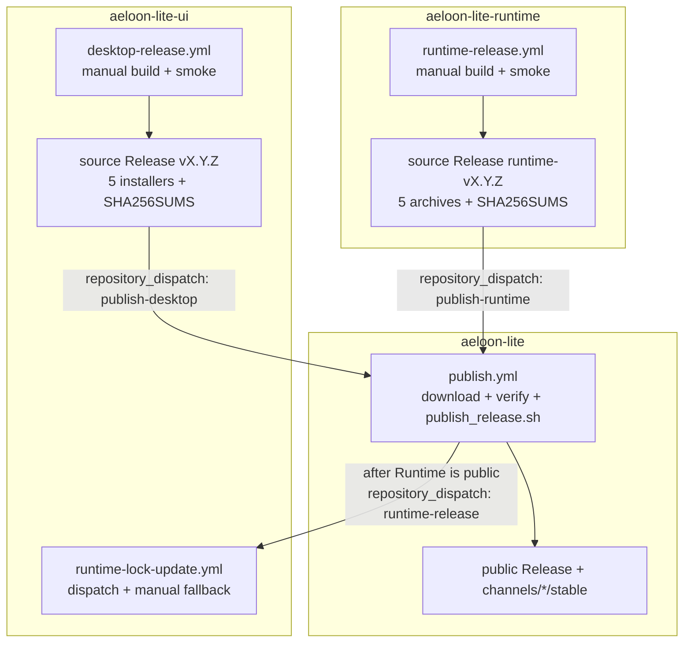

# Stable release operations

Runtime and Desktop build and publish their own source Releases. This repository is the public
distribution surface: it downloads the exact assets from a source Release, verifies them, runs
`tools/publish_release.sh` locally, and updates the public stable channel.

## Release flow



The public URLs do not change. Installers still read `channels/desktop/stable` and
`channels/runtime/stable` from this repository, and the tag formats remain `vX.Y.Z` for Desktop
and `runtime-vX.Y.Z` for Runtime.

## Normal release transaction

1. Merge a stable version bump into protected `main` in the source repository and wait for normal
   CI.
2. Dispatch the source workflow from `main`. It derives the version from `package.json` or
   `pyproject.toml`, builds every artifact, runs smoke tests, creates the immutable source tag, and
   creates the source Release with five assets and `SHA256SUMS`.
3. The source workflow sends `publish-runtime` or `publish-desktop` to this repository with the
   product, version, and source commit.
4. `publish.yml` resolves the source tag, downloads its Release assets, verifies the tag commit,
   checks the fixed asset set and every SHA-256 entry, then runs `tools/publish_release.sh`.
5. The publisher creates or resumes the public Draft, compares GitHub asset digests, makes the
   Release public, and opens an auto-merge PR for the matching stable channel file. It waits for
   that PR to merge before a Runtime publication sends `runtime-release` to the Desktop lock
   workflow.
6. The lock workflow reads the public Runtime stable checksums, copies protocol types when needed,
   and opens one auto-merge PR. Desktop stays on its previous Runtime until that PR merges.

Published Releases are immutable. A rerun with the same source commit and identical bytes repairs
an interrupted dispatch or channel update; different bytes require a new version.

## Manual fallback and replay

Start a normal source release manually:

```bash
gh workflow run runtime-release.yml \
  --repo AetherHeart-AI/aeloon-lite-runtime --ref main

gh workflow run desktop-release.yml \
  --repo AetherHeart-AI/aeloon-lite-ui --ref main
```

If a source Release exists but its dispatch was lost, replay the distribution step. The workflow
resolves the source tag and commit itself, so no commit hash needs to be copied:

```bash
gh workflow run publish.yml \
  --repo AetherHeart-AI/aeloon-lite \
  -f product=runtime -f version=0.1.5

gh workflow run publish.yml \
  --repo AetherHeart-AI/aeloon-lite \
  -f product=desktop -f version=0.0.22
```

If the public Runtime publication succeeded but the Desktop lock dispatch was lost, replay the lock
update directly:

```bash
gh workflow run runtime-lock-update.yml \
  --repo AetherHeart-AI/aeloon-lite-ui \
  -f release_tag=runtime-v0.1.5
```

Inspect the source Release and stable channel before replaying a version. The publisher rejects a
Release whose assets differ from the current build and never overwrites a published Release.

## Unified release token

Create one organization Actions secret under `AetherHeart-AI` with the name
`AELOON_RELEASE_TOKEN`, and set its repository access to only these three repositories:

- `AetherHeart-AI/aeloon-lite-runtime`
- `AetherHeart-AI/aeloon-lite-ui`
- `AetherHeart-AI/aeloon-lite`

The PAT must be scoped to only these three repositories and grant `Contents: Read and write` and
`Pull requests: Read and write`. The broader scope simplifies setup but means that a workflow in
any of the three repositories can use the same token's write access. Source Releases and public
distribution Releases still use each job's scoped `GITHUB_TOKEN` for their own repository.

## Recovery rules

- A build, package, install, or source asset verification failure leaves the current stable file
  unchanged.
- If source Release creation succeeds but distribution is not updated, rerun `publish.yml` with
  the same product and version.
- If distribution succeeds but the lock PR is not opened, rerun `runtime-lock-update.yml` with the
  public Runtime tag.
- To roll back, restore an older `channels/<product>/stable` value from Git history. Never delete,
  replace, or mutate a published Release.
